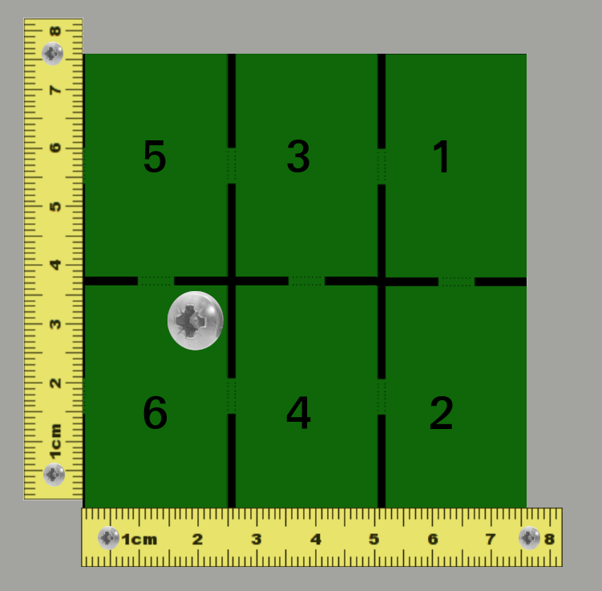
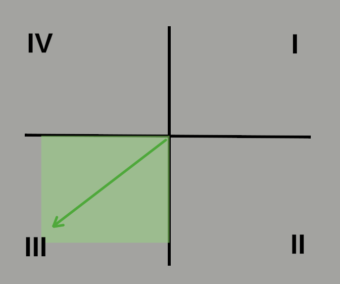
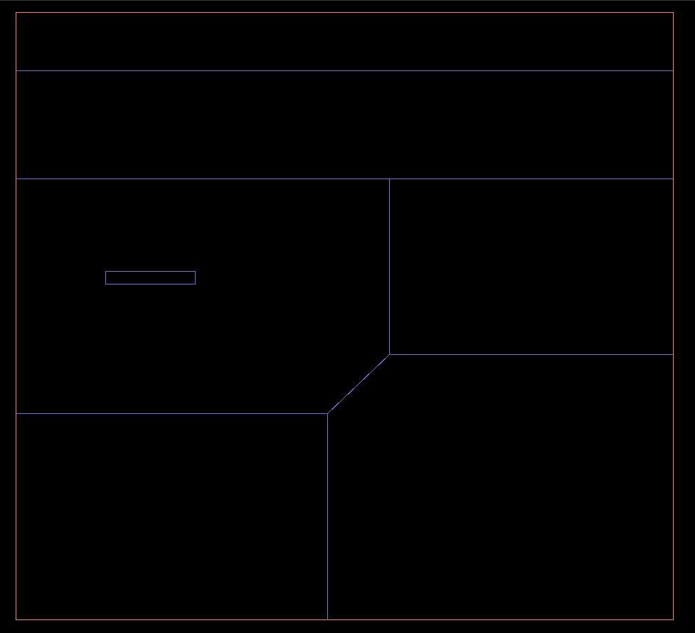
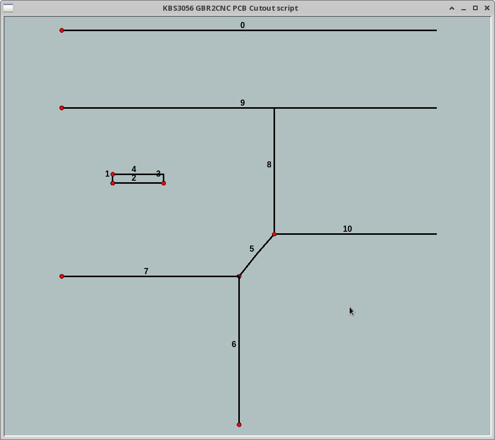
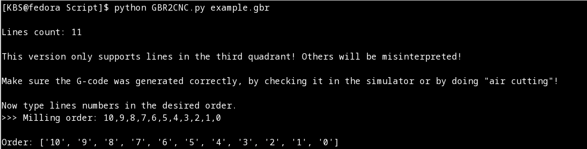

# GBR2CNC
Simple and fast script to generate PCB cutout G-code from a Gerber file.
Center of a drawn single line (not contours) will be converted to one step down, one pass slot with a width equal to a milling cutter diameter.
PCB is placed against two guide edges on the left and bottom sides. Only one fastener is needed to hold the last cut fragment of the board. Principle of operation limits lines angles to a third quadrant, where the origin is a line starting possition. Q I lines will be translated to Q III, but ones in Q II and Q IV will be misinterpreted! 

## Usage
python GBR2CNC.py example.gbr

Script will display a line drawing animation, and then ask to type the lines numbers in the desired cutting order.

Make sure the G-code was generated correctly, by checking it in a simulator or by doing "air cutting".
There is a possibility of collision when the shape of the PCB is not rectangular. At the end of the program, the cutter will move out to the top right corner of a bounding box.

Demonstration with a random order. It would make more sense that way: Order: [0, 9, 8, 10, 1, 3, 4, 2, 5, 7, 6].

https://www.youtube.com/watch?v=zSfO_ZE0Tw8
